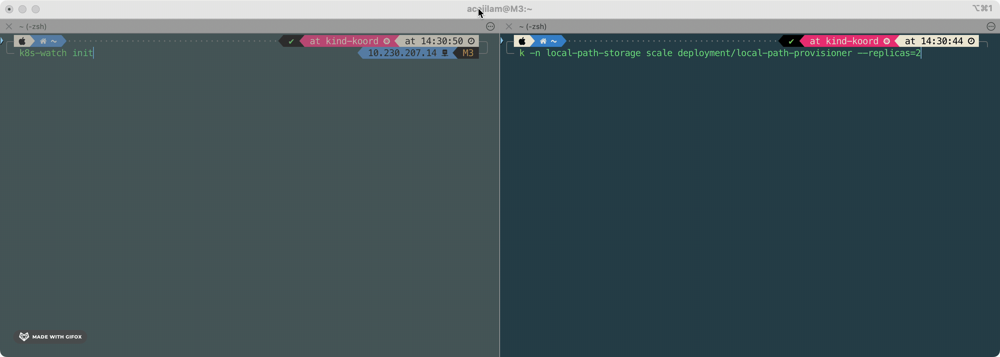

Monitoring the transformation of any attribute of any resource.

## Contributors

## Contact

If you've got any questions, please feel free to contact us with following ways:

- [open a github issue](https://github.com/ls-2018/k8s-watch/issues/new/choose)

